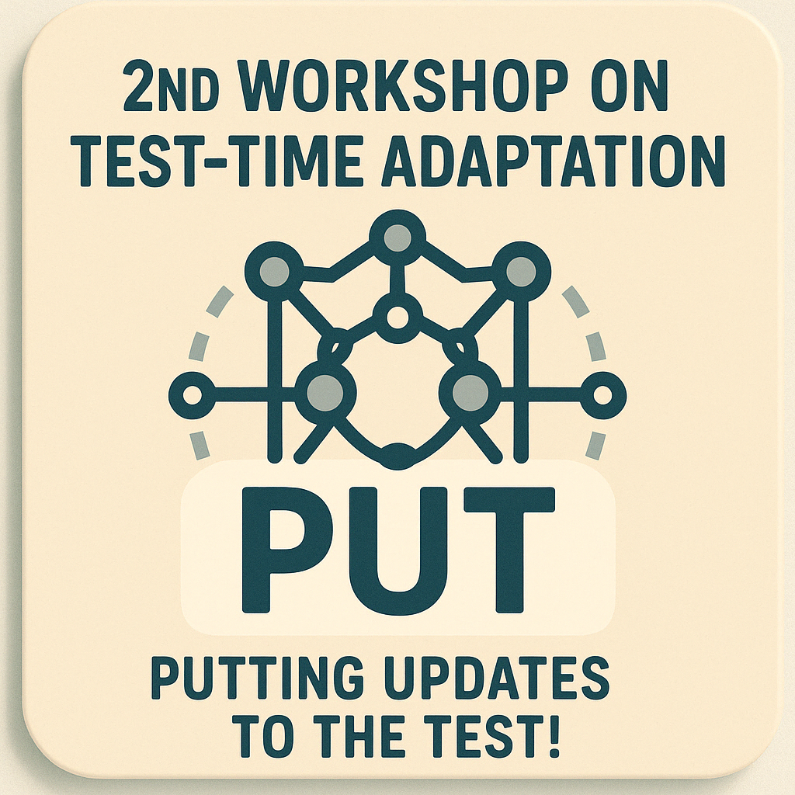

2nd Workshop on Test-Time Adaptation: Putting Updates to the Test! (PUT)
========================================================================

*ICML 2025 workshop*

Our second workshop on test-time adaptation will be held at ICML 2025 this summer in Vancouver!

**When and Where.** The workshop will be held on Jul. 18! Come join us in Meeting 220-222.

**Scope.** Note the increased scope from the last edition to now encompass test-time updates more broadly.
As a workshop at ICML, it is important to host and cross-pollinate work across different learning settings and domains.

Consider joining us to discover and contribute to the latest on updates after training: *the test begins now!*

Call for Papers
---------------

**Topics** We will welcome and highlight content on test-time and post-training updates:

- opportunities and challenges for test-time updates for specific applications or deployments;
- unsupervised or self-supervised losses for optimization during testing;
- parameterizations of updates to inputs, models, or outputs at any scale and for white-box and black-box systems (including updates to open or closed foundation model systems);
- coping with test-time input shifts (domain adaptation), test-time attacks (adversarial defense), or test-time task changes (online continual learning);
- metrics/datasets/benchmarks to validate and evaluate test-time updates by the changes in performance measures and the computation required;
- adapting large-scale/foundation models (LLMs, VLMs, etc.) to specialized or personalized domains whether by in-context learning / adaptation / continual learning / editing.

**Keywords** Adaptation, Continual Learning, Robustness, Personalization

**Format**
We will welcome submission of short papers (= 4 pages content without the references as well as an (optional) Appendix with an unlimited number of pages). Accepted submissions will be selected for poster, lightning talk (= 1 slide in 1 minute), and oral presentation at the workshop.
The workshop will not include proceedings.

*We welcome the submission of relevant, high-quality, short paper versions of papers accepted to the main conference.*

Paper Submission (Done)
-----------------------

**The deadline is done! It was May 23 2025 at midnight (AoE)**.

Please see the system on OpenReview: `<https://openreview.net/group?id=ICML.cc/2025/Workshop/PUT>`_.

- Decisions: June 9th
- Camera ready: July 9th

Call for Reviewers (Done)
------------------------

**Thank you to all of our volunteers who signed up to review! The review period has already begun and the sign-up form is now closed.**

We are looking for qualified reviewers to help us select papers for the workshop.
All reviewers will be credited for their academic service on the workshop site.
If you have published on test-time adaptation, continual learning, model editing, and the other topics of our call then please volunteer.

Invited Speakers
----------------

.. raw:: html
    :file: speakers.html

Organizers
----------

.. raw:: html
    :file: organizers.html

Program Committee
-----------------

All reviewers and meta-reviewers will be listed here.

Logistics
---------

Coming soon

Contact
-------

Please reach the workshop organizers at ``tta-icml25@googlegroups.com``.

.. toctree::
   :maxdepth: 2
   :hidden:

   Home <self>
   Schedule <schedule>
   Papers <papers>

.. meta::
      :title: 2nd Workshop on Test-Time Adaptation: Putting Updates to the Test! (PUT)

      :description lang=en:
         Our second workshop on test-time adaptation will be held at ICML 2025 this summer in Vancouver!
